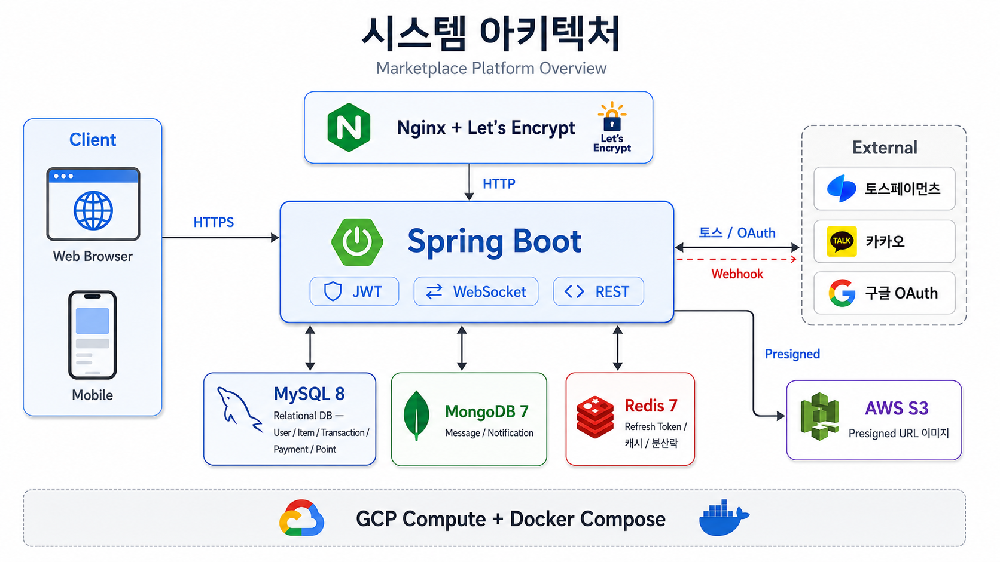
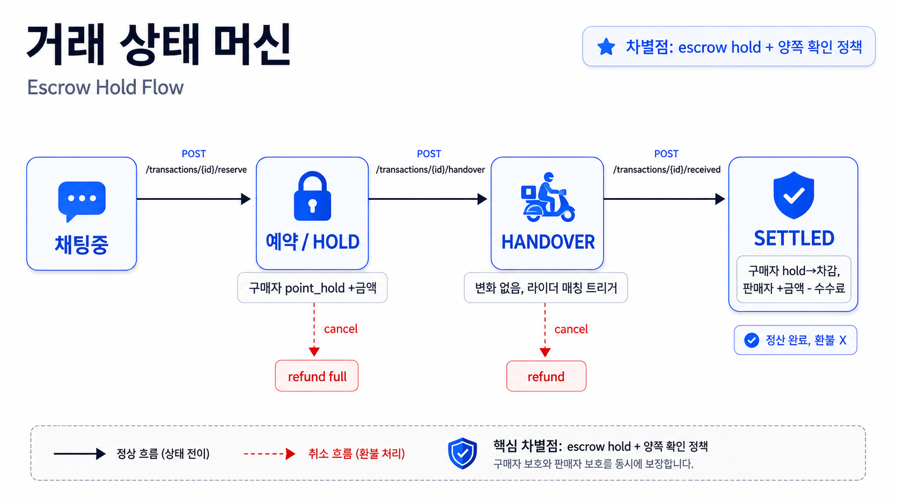
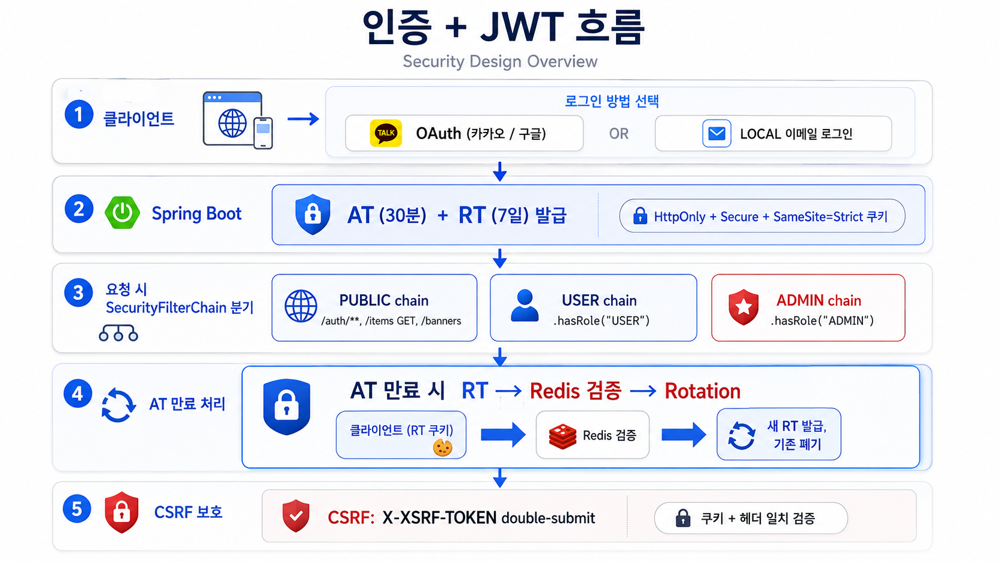
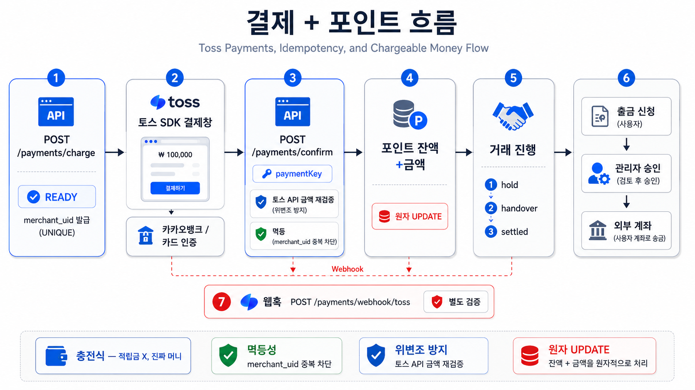

# 쓸랭 (Sseulang) — C2C 통합 거래 플랫폼 백엔드

> 중고 거래 + 대여 + 나눔 + 배달대행을 통합한 C2C 플랫폼 백엔드

[](.)
[](.)
[](.)
[](.)

🔗 **라이브 데모**: [api.sseulang.store](https://api.sseulang.store) · [Swagger UI](https://api.sseulang.store/swagger-ui.html)

---

## 핵심 기능

49개 유스케이스를 6개 묶음으로 구현했습니다.

| 묶음 | 핵심 |
|---|---|
| 🛒 **거래** | 판매 / 대여 / 나눔 3유형, 직접 거래 상태 머신 + 거래대행 lifecycle |
| 💳 **결제·포인트** | 토스페이먼츠 실연동, 충전식 플랫폼 머니, 거래대행 정산/보증금 hold |
| 💬 **채팅·알림** | WebSocket + STOMP 실시간, MongoDB 영속, JWT 통합 인증 |
| 🛵 **배달대행** | 라이더 매칭, 위치 트래킹, Redis 캐시 + STOMP 브로드캐스트 |
| 🔐 **인증** | OAuth 카카오 / 구글 + LOCAL 이메일 인증, JWT + Refresh Rotation |
| 🛠 **관리자** | 통계 대시보드, 신고 처리, 출금 승인, 배너 / 공지 관리 |

---

## 아키텍처



- **백엔드**: Spring Boot 기반 REST API + WebSocket/STOMP 실시간 통신
- **DB**: MySQL 8, MongoDB 7, Redis 7
- **외부 연동**: 토스페이먼츠, 카카오·구글 OAuth, AWS S3 Presigned URL
- **인프라**: GCP Compute Engine, Docker Compose, Nginx, Let's Encrypt

---

## 도메인 구조

14개 도메인을 `presentation → application → domain ← infrastructure` 방향의 4-layer 구조로 구성했습니다.

```text
com.sseulang
├── global/             # config, security, exception, common, infra
└── domain/
    ├── user/           # Aggregate Root + VO: Email, Phone, PointBalance
    ├── auth/           # OAuth + LOCAL + JWT + Refresh Rotation
    ├── item/           # 상품 3유형 + 이미지 + 카테고리 + 해시태그
    ├── transaction/    # 직접 거래 상태 머신, paired escrow transaction
    ├── payment/        # 토스 결제 + 멱등성
    ├── point/          # 충전식 머니, 원자 UPDATE
    ├── delivery/       # 배달대행 + 위치 트래킹
    ├── chat/           # 채팅방 + 메시지, MongoDB
    ├── notification/   # 알림, MongoDB
    ├── escrow/         # 거래대행, 양방향 대여 배달, 수수료/보증금 정산
    ├── review/         # 신뢰도, 양방향 별점
    ├── report/         # 신고
    ├── support/        # 고객센터
    └── admin/          # 통계 + 출금 승인
```

각 도메인은 `presentation / application / domain / infrastructure` 계층을 기준으로 분리했습니다.

---

## 기술 결정 하이라이트

| 결정 | 이유 |
|---|---|
| **DDD-lite** | Aggregate / VO / DomainEvent / Repository 인터페이스 분리는 채택하되, 1인 9일 일정상 헥사고날 모듈 분리와 CQRS는 제외 |
| **충전식 포인트** | 가입 보너스나 추가 적립금이 아닌 거래 통화 머니로 설계해 시스템 적자 방지 |
| **직접 거래와 거래대행 분리** | 직접 거래는 상태/Item 잠금만 관리하고, 포인트 정산/보증금/라이더 매칭은 거래대행에서 처리 |
| **JWT + CSRF 이중 가드** | HttpOnly + Secure + SameSite=Strict 쿠키와 X-XSRF-TOKEN double-submit 적용 |
| **SecurityFilterChain 3분리** | PUBLIC / USER / ADMIN 체인을 분리해 권한별 진입 경로 명확화 |
| **잔액 변경 = 원자 UPDATE** | `WHERE balance + amt >= 0` 단일 쿼리로 동시성 race 방어 |
| **TDD 강제 영역** | 보안·결제·포인트·거래 상태·동시성·토큰 Rotation은 RED → GREEN → REFACTOR 우선 적용 |

---

## 거래 흐름



```text
직접 거래(판매/나눔): [채팅중] ─예약─▶ [예약] ─인계확인─▶ [인계완료] ─인수확인/완료─▶ [거래완료]
직접 거래(대여):     [채팅중] ─예약─▶ [예약] ─인계확인─▶ [인계완료] ─반납요청─▶ [반납요청] ─회신확인─▶ [거래완료]

거래대행(대여):      [결제완료] ─forward 배송─▶ [진행중] ─수령확인─▶ [사용중] ─반납요청/자동반납─▶ [반납중] ─회신확인─▶ [완료]
```

잔액 효과는 다음과 같습니다.

- **직접 거래**: 사이트 포인트 정산 없음. 백엔드는 상태와 Item 잠금만 관리
- **거래대행 결제**: 참여자 share 만큼 포인트 차감, 대여 보증금은 buyer `point_hold` 로 이동
- **거래대행 완료**: 판매자 `itemPrice` 정산, forward/return 라이더 정산, 보증금 refundHold
- **자동 반납**: `rentalEndAt` 경과 시 buyer 수동 반납과 동일하게 return fee 차감 + return delivery 모집

---

## 인증 + JWT



- **AT**: 30분, payload는 `userId + role + jti`
- **RT**: 7일, Redis 저장, 사용 시 새 RT 발급 + 기존 RT 폐기
- **저장 위치**: HttpOnly + Secure + SameSite=Strict 쿠키
- **CSRF**: X-XSRF-TOKEN 헤더와 쿠키 값 일치 검증
- **체인 분리**: PUBLIC / USER / ADMIN SecurityFilterChain
- **에러 정책**: 로그인 실패는 `AUTH_LOGIN_FAILED`로 통합해 이메일 존재 여부 노출 방지

---

## 결제 + 포인트



```text
[1] POST /payments/charge   → READY, merchant_uid UNIQUE 발급
[2] 토스 SDK 결제창          → 카드 / 카카오뱅크 인증
[3] POST /payments/confirm  → 토스 API 금액 재검증 + 멱등 처리
[4] 포인트 잔액 +금액        → 원자 UPDATE
[5] 거래대행 결제/정산       → 판매자·라이더 적립, 보증금 hold/refund, PG 재호출 없음
[6] 출금 신청 → 관리자 승인 → 외부 계좌
[7] 웹훅 POST /payments/webhook/toss → HMAC signature + timestamp + Toss lookup 검증
```

결제 구조의 핵심은 **충전식 플랫폼 머니**, **merchant_uid 기반 멱등성**, **토스 API 금액 재검증**, **webhook HMAC 검증**, **잔액 원자 UPDATE**입니다.

---

## 기술 스택

| 카테고리 | 스택 |
|---|---|
| **언어 / 빌드** | Java 21, Gradle |
| **Web** | Spring Boot 3.3.5, Spring Security, Spring WebSocket + STOMP |
| **DB / ORM** | MySQL 8, MongoDB 7, Redis 7, JPA(Hibernate), QueryDSL, Flyway |
| **인증** | JWT, OAuth2 Client, BCrypt |
| **외부 연동** | 토스페이먼츠 REST + 웹훅, AWS S3 Presigned URL |
| **테스트** | JUnit 5, Mockito, AssertJ, Testcontainers, spring-security-test |
| **인프라** | Docker Compose, GCP Compute, Nginx, Let's Encrypt |
| **API 문서** | springdoc-openapi, Swagger UI |

---

## 테스트 전략

**TDD**를 영역별 강도에 따라 차등 적용했습니다.

| 영역 | 강도 |
|---|---|
| 보안 / 결제 / 포인트 / 거래 상태 / JWT / 동시성 | 🔒 구현 전 RED 필수 |
| 일반 도메인 로직 | TDD 권장 |
| Controller / DTO / 설정 | 통합 테스트로 검증 |

테스트 흐름은 `domain` 순수 단위 테스트 → `application` Mockito 테스트 → `@WebMvcTest`, `@DataJpaTest` 슬라이스 테스트 → `@SpringBootTest + Testcontainers` 통합 테스트 순으로 구성했습니다.

동시성 테스트는 `CompletableFuture`와 `CountDownLatch`로 race 상황을 재현하고, 락 또는 원자 연산이 정상 동작하는지 검증했습니다.

---

## 배포

- **이미지**: Docker Hub `seodongbe/sseulang-backend:latest`
- **호스팅**: GCP Compute Engine + Docker Compose
- **TLS**: Nginx 리버스 프록시 + Let's Encrypt 자동 갱신
- **도메인**: `api.sseulang.store` / `www.sseulang.store`

자세한 절차는 [`docs/PROD_DEPLOY.md`](docs/PROD_DEPLOY.md)에서 관리합니다.

---

## 로컬 실행

### 1. 인프라 실행

```bash
docker compose up -d
```

- MySQL: `localhost:3307`
- Redis: `localhost:6380`
- MongoDB: `localhost:27017`

### 2. 환경변수 설정

```bash
cp .env.example .env
# JWT_SECRET 등 필요한 값 입력
```

### 3. 애플리케이션 실행

```bash
./gradlew bootRun
```

- API: <http://localhost:8080>
- Swagger UI: <http://localhost:8080/swagger-ui.html>

---

## 컨벤션 / Codex 듀얼 운영

Claude Code 작성 + Codex 리뷰 방식으로 듀얼 에이전트 운영 규칙을 적용했습니다.

- **게이트 1**: 보안·결제·포인트·동시성 영역 작성 직후 리뷰
- **게이트 2**: PR 전 전체 리뷰
- **게이트 3**: 본인 디버깅 30분 이후 막힘 상황 리뷰
- **제외 영역**: 단순 CRUD, DTO, 설정성 코드

자세한 룰은 [`.claude/CLAUDE.md`](.claude/CLAUDE.md) §9에서 관리합니다.

---

## 라이선스 / 연락처

- License: Proprietary (TBD)
- 개발: [@SD-gif](https://github.com/SD-gif)
